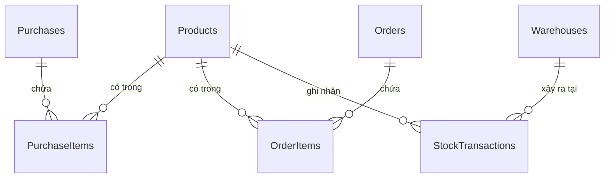

# KẾ HOẠCH CHI TIẾT TÁI CẤU TRÚC HỆ THỐNG QUẢN LÝ TỒN KHO & NHẬP XUẤT KHO

Tài liệu này mô tả chi tiết thiết kế Cơ sở dữ liệu mới (đã loại bỏ `ProductVariant`), đặc tả chi tiết 4 API cốt lõi với cấu trúc đầy đủ thông tin phiếu & sản phẩm (bao gồm `supplierId` cho nhập kho và `customerId` cho xuất kho), và các API Sửa/Xóa kèm luồng xử lý tương ứng.

---

## PHẦN 1: THIẾT KẾ CHI TIẾT CÁC BẢNG TRONG DATABASE (DATABASE SCHEMA)

Sau khi loại bỏ hoàn toàn khái niệm **Biến thể sản phẩm (ProductVariant)**, cơ cấu các bảng dữ liệu sẽ được đơn giản hóa và tập trung trực tiếp vào **Sản phẩm (Product)**.



### 1. Bảng `Products` (Sản phẩm)
Bảng này trực tiếp quản lý thông tin giá cả và số lượng tồn kho vật lý hiện tại của sản phẩm.
*   `Id` (int, Khóa chính, Tự tăng)
*   `Name` (nvarchar(250), Bắt buộc)
*   `Description` (nvarchar(max), Cho phép Null)
*   `CategoryId` (int, Khóa ngoại -> `Categories`)
*   `Code` (nvarchar(100), Cho phép Null, dùng làm mã SKU/IMEI duy nhất của sản phẩm)
*   `IsActive` (bool, mặc định `true`)
*   `CreateDate` (datetime, Bắt buộc)
*   `LastModifiedDate` (datetime, Cho phép Null)
*   `IsDeleted` (bool, mặc định `false`, dùng để xóa tạm)
*   **`StockQuantity` (int, mặc định `0`)** -> Số lượng tồn kho thực tế hiện tại.
*   **`OriginalPrice` (decimal, mặc định `0`)** -> Giá vốn/Giá nhập gốc.
*   **`SellingPrice` (decimal, mặc định `0`)** -> Giá bán hiện tại.

### 2. Bảng `Purchases` (Phiếu Nhập Kho)
*   `Id` (int, Khóa chính, Tự tăng)
*   `SupplierId` (int, Bắt buộc) -> Mã nhà cung cấp
*   `SupplierName` (nvarchar(250), Cho phép Null) -> Tên nhà cung cấp (để lưu dấu vết lịch sử hiển thị nhanh)
*   `ReceiptDate` (datetime, Bắt buộc) -> Ngày nhập kho thực tế
*   `ReferenceCode` (nvarchar(100), Cho phép Null) -> Mã chứng từ mua hàng (ví dụ: `PO-202605-001`)
*   `Note` (nvarchar(500), Cho phép Null) -> Ghi chú
*   `TotalAmount` (decimal, mặc định `0`) -> Tổng trị giá tiền hàng của phiếu nhập
*   `CreateDate` (datetime, Bắt buộc)
*   `LastModifiedDate` (datetime, Cho phép Null)
*   `Status` (int / Enum: `Pending` = 0, `Confirmed` = 1) -> Trạng thái phiếu
*   `IsCanceled` (bool, mặc định `false`) -> Đã hủy phiếu hay chưa
*   `CancelReason` (nvarchar(500), Cho phép Null)
*   `CanceledDate` (datetime, Cho phép Null)
*   `CanceledBy` (nvarchar(100), Cho phép Null)
*   `WarehouseId` (int, Khóa ngoại -> `Warehouses`)

### 3. Bảng `PurchaseItems` (Chi tiết Phiếu Nhập Kho)
*   `Id` (int, Khóa chính, Tự tăng)
*   `PurchaseId` (int, Khóa ngoại -> `Purchases`)
*   `ProductId` (int, Khóa ngoại -> `Products`) -> Liên kết trực tiếp tới bảng Products
*   `Quantity` (int, Bắt buộc) -> Số lượng sản phẩm nhập kho
*   `UnitPrice` (decimal, Bắt buộc) -> Đơn giá nhập của sản phẩm
*   `TotalPrice` (decimal, Bắt buộc) -> Thành tiền (`Quantity * UnitPrice`)
*   `CreateDate` (datetime, Bắt buộc)
*   `LastModifiedDate` (datetime, Cho phép Null)
*   `IsDeleted` (bool, mặc định `false`)

### 4. Bảng `Orders` (Phiếu Xuất Kho)
*   `Id` (int, Khóa chính, Tự tăng)
*   `CustomerId` (int, Bắt buộc) -> Mã khách hàng nhận
*   `CustomerName` (nvarchar(250), Cho phép Null) -> Tên khách hàng
*   `ReceiptDate` (datetime, Bắt buộc) -> Ngày xuất kho thực tế
*   `ReferenceCode` (nvarchar(100), Cho phép Null) -> Mã chứng từ xuất hàng (ví dụ: `SO-202605-001`)
*   `Note` (nvarchar(500), Cho phép Null) -> Ghi chú xuất kho
*   `TotalAmount` (decimal, mặc định `0`) -> Tổng trị giá của đơn xuất kho
*   `CreateDate` (datetime, Bắt buộc)
*   `LastModifiedDate` (datetime, Cho phép Null)
*   `Status` (int / Enum: `Pending` = 0, `Confirmed` = 1) -> Trạng thái phiếu
*   `IsCanceled` (bool, mặc định `false`) -> Đã hủy phiếu hay chưa
*   `CancelReason` (nvarchar(500), Cho phép Null)
*   `CanceledDate` (datetime, Cho phép Null)
*   `CanceledBy` (nvarchar(100), Cho phép Null)
*   `WarehouseId` (int, Khóa ngoại -> `Warehouses`)

### 5. Bảng `OrderItems` (Chi tiết Phiếu Xuất Kho)
*   `Id` (int, Khóa chính, Tự tăng)
*   `OrderId` (int, Khóa ngoại -> `Orders`)
*   `ProductId` (int, Khóa ngoại -> `Products`) -> Liên kết trực tiếp tới bảng Products
*   `Quantity` (int, Bắt buộc) -> Số lượng sản phẩm xuất kho
*   `UnitPrice` (decimal, Bắt buộc) -> Đơn giá bán thực tế của sản phẩm
*   `TotalPrice` (decimal, Bắt buộc) -> Thành tiền (`Quantity * UnitPrice`)
*   `CreateDate` (datetime, Bắt buộc)
*   `LastModifiedDate` (datetime, Cho phép Null)

### 6. Bảng `StockTransactions` (Sổ kho / Thẻ kho)
Bảng ghi nhận lịch sử thay đổi tồn kho vật lý của sản phẩm để lập các báo cáo Nhập-Xuất-Tồn.
*   `Id` (int, Khóa chính, Tự tăng)
*   `ProductId` (int, Khóa ngoại -> `Products`)
*   `WarehouseId` (int, Khóa ngoại -> `Warehouses`)
*   `QuantityChange` (int, Bắt buộc) -> Biến động số lượng (Số dương cho nhập, Số âm cho xuất)
*   `BalanceBefore` (int, Bắt buộc) -> Số tồn kho khả dụng ngay trước khi giao dịch xảy ra
*   `BalanceAfter` (int, Bắt buộc) -> Số tồn kho khả dụng ngay sau khi giao dịch xảy ra
*   `TransactionType` (int) -> Loại biến động (Ví dụ: `Import` = 0, `Export` = 1)
*   `ReferenceType` (int) -> Loại tài liệu tham chiếu (Ví dụ: `Purchase` = 0, `Order` = 1)
*   `ReferenceId` (int, Bắt buộc) -> ID của phiếu nhập (`PurchaseId`) hoặc phiếu xuất (`OrderId`)
*   `Note` (nvarchar(500), Cho phép Null) -> Mô tả chi tiết giao dịch
*   `CreateDate` (datetime, Bắt buộc)

---

## PHẦN 2: CHI TIẾT ĐẶC TẢ 4 API CỐT LÕI (STOCK TRANSACTIONS CONTROLLER)

### 1. `POST /api/StockTransactions/import-stock` (Tạo Phiếu Nhập Kho)
*   **Mô tả:** Nhận thông tin phiếu nhập từ Client và khởi tạo phiếu nhập mới.
*   **Request Payload (JSON):**
    ```json
    {
      "supplierId": 101,
      "supplierName": "Công ty TNHH ABC", 
      "receiptDate": "2026-05-19T15:30:00.000Z",
      "referenceCode": "PO-202605-001",
      "note": "Nhập hàng đợt 1 tháng 5",
      "warehouseId": 1
    }
    ```
*   **Response Payload (JSON - 201 Created):**
    ```json
    {
      "id": 12,
      "supplierId": 101,
      "supplierName": "Công ty TNHH ABC", 
      "receiptDate": "2026-05-19T15:30:00.000Z",
      "referenceCode": "PO-202605-001",
      "note": "Nhập hàng đợt 1 tháng 5",
      "totalAmount": 0,
      "status": "Pending",
      "createDate": "2026-05-19T15:37:03.436Z",
      "lastModifiedDate": "2026-05-19T15:37:03.436Z",
      "isCanceled": false,
      "cancelReason": null,
      "canceledDate": null,
      "canceledBy": null,
      "warehouseId": 1,
      "items": []
    }
    ```

### 2. `POST /api/StockTransactions/export-stock` (Tạo Phiếu Xuất Kho)
*   **Mô tả:** Nhận thông tin phiếu xuất từ Client và khởi tạo phiếu xuất mới (Thay thế `supplierId` bằng `customerId`).
*   **Request Payload (JSON):**
    ```json
    {
      "customerId": 202,
      "customerName": "Khách hàng Nguyễn Văn A", 
      "receiptDate": "2026-05-19T15:30:00.000Z",
      "referenceCode": "SO-202605-001",
      "note": "Xuất hàng đợt 1 tháng 5",
      "warehouseId": 1
    }
    ```
*   **Response Payload (JSON - 201 Created):**
    ```json
    {
      "id": 8,
      "customerId": 202,
      "customerName": "Khách hàng Nguyễn Văn A", 
      "receiptDate": "2026-05-19T15:30:00.000Z",
      "referenceCode": "SO-202605-001",
      "note": "Xuất hàng đợt 1 tháng 5",
      "totalAmount": 0,
      "status": "Pending",
      "createDate": "2026-05-19T15:37:03.436Z",
      "lastModifiedDate": "2026-05-19T15:37:03.436Z",
      "isCanceled": false,
      "cancelReason": null,
      "canceledDate": null,
      "canceledBy": null,
      "warehouseId": 1,
      "items": []
    }
    ```

### 3. `POST /api/StockTransactions/importData` (Thêm Sản Phẩm Vào Phiếu Nhập)
*   **Mô tả:** Nhận danh sách sản phẩm đính kèm theo `purchaseId` (ID phiếu nhập), tự động tăng tồn kho vật lý của sản phẩm và ghi nhận thẻ kho.
*   **Request Payload (JSON):**
    ```json
    {
      "purchaseId": 12,
      "items": [
        {
          "productId": 10,
          "quantity": 50,
          "unitPrice": 100000
        },
        {
          "productId": 12,
          "quantity": 20,
          "unitPrice": 500000
        }
      ]
    }
    ```
*   **Response Payload (JSON - 200 OK):**
    ```json
    {
      "id": 12,
      "supplierId": 101,
      "supplierName": "Công ty TNHH ABC", 
      "receiptDate": "2026-05-19T15:30:00.000Z",
      "referenceCode": "PO-202605-001",
      "note": "Nhập hàng đợt 1 tháng 5",
      "totalAmount": 15000000,
      "status": "Confirmed",
      "createDate": "2026-05-19T15:37:03.436Z",
      "lastModifiedDate": "2026-05-19T16:05:00.000Z",
      "isCanceled": false,
      "cancelReason": null,
      "canceledDate": null,
      "canceledBy": null,
      "warehouseId": 1,
      "items": [
        {
          "productId": 10,
          "quantity": 50,
          "unitPrice": 100000,
          "totalPrice": 5000000
        },
        {
          "productId": 12,
          "quantity": 20,
          "unitPrice": 500000,
          "totalPrice": 10000000
        }
      ]
    }
    ```

### 4. `POST /api/StockTransactions/exportData` (Thêm Sản Phẩm Vào Phiếu Xuất)
*   **Mô tả:** Nhận danh sách sản phẩm đính kèm theo `orderId` (ID phiếu xuất), kiểm tra tồn kho, trừ tồn kho vật lý của sản phẩm và ghi nhận thẻ kho.
*   **Request Payload (JSON):**
    ```json
    {
      "orderId": 8,
      "items": [
        {
          "productId": 10,
          "quantity": 15,
          "unitPrice": 150000
        },
        {
          "productId": 12,
          "quantity": 5,
          "unitPrice": 600000
        }
      ]
    }
    ```
*   **Response Payload (JSON - 200 OK):**
    ```json
    {
      "id": 8,
      "customerId": 202,
      "customerName": "Khách hàng Nguyễn Văn A", 
      "receiptDate": "2026-05-19T15:30:00.000Z",
      "referenceCode": "SO-202605-001",
      "note": "Xuất hàng đợt 1 tháng 5",
      "totalAmount": 5250000,
      "status": "Confirmed",
      "createDate": "2026-05-19T15:37:03.436Z",
      "lastModifiedDate": "2026-05-19T16:05:00.000Z",
      "isCanceled": false,
      "cancelReason": null,
      "canceledDate": null,
      "canceledBy": null,
      "warehouseId": 1,
      "items": [
        {
          "productId": 10,
          "quantity": 15,
          "unitPrice": 150000,
          "totalPrice": 2250000
        },
        {
          "productId": 12,
          "quantity": 5,
          "unitPrice": 600000,
          "totalPrice": 3000000
        }
      ]
    }
    ```

---

## PHẦN 3: ĐẶC TẢ CÁC API SỬA & XÓA PHIẾU (CRUD HOÀN CHỈNH)

### 1. Đối Với Nghiệp Vụ Nhập Kho (Import)

#### A. API Sửa Phiếu Nhập
*   **Endpoint:** `PUT /api/StockTransactions/import-stock/{id}`
*   **Mô tả:** Cập nhật thông tin chung hoặc danh sách sản phẩm đi kèm. Hỗ trợ cập nhật đầy đủ cấu trúc phiếu bao gồm cả danh sách `items` mới.
*   **Request Body (JSON):** Nhận đầy đủ cấu trúc phiếu như API `importData` nhưng có thêm các thông tin Header cần sửa.
*   **Luồng xử lý (Sử dụng Transaction):**
    1.  Mở Transaction.
    2.  Tìm phiếu nhập `Purchase` cũ. Lấy danh sách chi tiết cũ (`PurchaseItems`).
    3.  **Hoàn trả tồn kho cũ:** Với mỗi chi tiết cũ:
        `Product.StockQuantity -= OldQuantity`.
    4.  Xóa các bản ghi `StockTransaction` và `PurchaseItems` cũ tương ứng với `PurchaseId`.
    5.  **Áp dụng chi tiết mới:** Với mỗi sản phẩm mới trong request:
        - Lấy tồn hiện hành làm `BalanceBefore`.
        - Tính `BalanceAfter = BalanceBefore + NewQuantity`.
        - Cập nhật tồn kho vật lý: `Product.StockQuantity = BalanceAfter`.
        - Tạo bản ghi `StockTransaction` mới ghi nhận `BalanceBefore` và `BalanceAfter`.
        - Tạo bản ghi `PurchaseItem` mới.
    6.  Tính toán lại `TotalAmount` của phiếu nhập và lưu các thông tin chung thay đổi.
    7.  Commit Transaction.

#### B. API Xóa Phiếu Nhập
*   **Endpoint:** `DELETE /api/StockTransactions/import-stock/{id}`
*   **Mô tả:** Hủy bỏ phiếu nhập kho, khôi phục tồn kho vật lý của các sản phẩm đã nhập về trạng thái trước đó.
*   **Luồng xử lý (Sử dụng Transaction):**
    1.  Mở Transaction.
    2.  Lấy danh sách `PurchaseItems` của phiếu cần xóa.
    3.  **Hoàn trả tồn kho:** Trừ tồn kho vật lý của từng sản phẩm tương ứng với số lượng đã nhập:
        `Product.StockQuantity -= Quantity`.
    4.  Xóa toàn bộ các bản ghi `StockTransaction` phát sinh của phiếu này.
    5.  Xóa các bản ghi `PurchaseItems`.
    6.  Xóa phiếu nhập chính `Purchase` (hoặc chuyển trạng thái sang `Cancelled` tùy theo chính sách lưu vết hệ thống, nếu xóa vật lý thì xóa bản ghi).
    7.  Commit Transaction.

---

### 2. Đối Với Nghiệp Vụ Xuất Kho (Export)

#### A. API Sửa Phiếu Xuất
*   **Endpoint:** `PUT /api/StockTransactions/export-stock/{id}`
*   **Mô tả:** Cập nhật thông tin phiếu xuất và danh sách sản phẩm xuất mới.
*   **Luồng xử lý (Sử dụng Transaction):**
    1.  Mở Transaction.
    2.  Lấy danh sách chi tiết cũ (`OrderItems`).
    3.  **Hoàn trả tồn kho cũ:** Cộng hoàn trả lại tồn kho vật lý của sản phẩm:
        `Product.StockQuantity += OldQuantity`.
    4.  **Kiểm tra tồn kho mới:** Kiểm tra xem số lượng tồn kho (sau khi cộng trả) có đáp ứng đủ nhu cầu xuất của danh sách sản phẩm mới hay không. Nếu không đủ hàng, Rollback và báo lỗi.
    5.  Xóa các bản ghi `StockTransaction` và `OrderItems` cũ tương ứng với `OrderId`.
    6.  **Áp dụng chi tiết mới:** Trừ tồn kho theo số lượng mới, tạo bản ghi `StockTransaction` và `OrderItem` mới.
    7.  Cập nhật lại `TotalAmount` của phiếu và lưu thông tin chung.
    8.  Commit Transaction.

#### B. API Xóa Phiếu Xuất
*   **Endpoint:** `DELETE /api/StockTransactions/export-stock/{id}`
*   **Mô tả:** Hủy bỏ phiếu xuất kho, cộng trả lại số lượng sản phẩm đã xuất vào tồn kho vật lý của sản phẩm.
*   **Luồng xử lý (Sử dụng Transaction):**
    1.  Mở Transaction.
    2.  Lấy danh sách `OrderItems` của phiếu xuất cần xóa.
    3.  **Hoàn trả tồn kho:** Cộng trả lại số lượng đã xuất vào tồn kho sản phẩm:
        `Product.StockQuantity += Quantity`.
    4.  Xóa toàn bộ các bản ghi `StockTransaction` phát sinh của phiếu này.
    5.  Xóa các bản ghi `OrderItems`.
    6.  Xóa phiếu xuất chính `Order`.
    7.  Commit Transaction.
